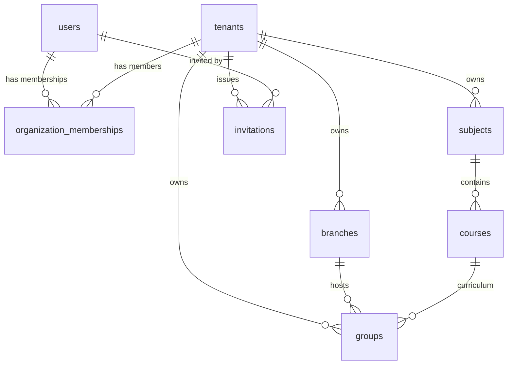

# Post-Implementation Audit: Authentication, Registration, Multi-Organization Membership & Onboarding

> Bu hujjatning to'liq nusxasi [docs/POST_IMPLEMENTATION_AUDIT.md](file:///c:/Users/user/Documents/GitHub/crmApp/docs/POST_IMPLEMENTATION_AUDIT.md) manzilida ham saqlangan.

**Audit Date:** 2026-09-23  
**Target Commits:** `41443ad` (*feat: complete auth, registration & onboarding redesign with multi-organization membership*) & `e2b1b6c` (*docs: update SETUP.md & RUNBOOK.md*)  
**Source of Truth:** [CRMAPP_MASTER_SPEC_V2.md](file:///c:/Users/user/Documents/GitHub/crmApp/CRMAPP_MASTER_SPEC_V2.md)  
**Repository:** `zemeisteer/crmApp` (branch `dev`)

---

## 1. Git / Implementation Summary

### Commits
- **`41443ad`**: Complete architecture implementation across backend and frontend (63 files changed, +10,455 / -1,453).
- **`e2b1b6c`**: Updated operational documentation [SETUP.md](file:///c:/Users/user/Documents/GitHub/crmApp/SETUP.md) and [RUNBOOK.md](file:///c:/Users/user/Documents/GitHub/crmApp/RUNBOOK.md).

### File Changes Breakdown

| Action | Path | Purpose |
| :--- | :--- | :--- |
| **NEW** | `backend/drizzle/0000_init_full_baseline.sql` | Production-ready full baseline SQL migration including `organization_memberships`, `invitations`, `subjects`, `courses`. |
| **DELETE**| `backend/drizzle/0000_blue_sersi.sql` | Obsolete initial migration snapshot replaced by baseline. |
| **NEW** | `backend/scripts/migrate-memberships.ts` | Non-destructive migration script moving all existing users to `organization_memberships` with active status. |
| **NEW** | `backend/scripts/e2e-verification.ts` | Live 11-step end-to-end verification script for auth, onboarding, invitations, and workspace switching. |
| **NEW** | `backend/src/invitations/*` | Complete cryptographic invitation module: DTOs, controller, service, unit specs (`invitations.service.spec.ts`). |
| **NEW** | `backend/src/onboarding/*` | Resumable 8-step onboarding module: DTOs, controller, service, unit specs (`onboarding.service.spec.ts`). |
| **NEW** | `backend/src/subjects/*` | Subject-agnostic domain module for subjects & courses: DTOs, controller, service, module. |
| **NEW** | `backend/src/leads/leads.service.spec.ts` | Unit tests for leads service and conversions. |
| **NEW** | `backend/src/students/students.service.spec.ts` | Unit tests for student service. |
| **NEW** | `backend/src/teachers/teachers.service.spec.ts` | Unit tests for teachers service. |
| **NEW** | `frontend/app/onboarding/page.tsx` | Full 8-step visual onboarding wizard with live subdomain validation and resumption. |
| **NEW** | `frontend/app/invite/[token]/page.tsx` | Public invitation activation portal for students, teachers, and staff. |
| **MODIFY**| `backend/src/db/schema.ts` | Added `OWNER`, `STUDENT`, `PARENT` roles; added tables `organization_memberships`, `invitations`, `subjects`, `courses`; added `onboarding_step`, `teaching_categories`, `country`, `timezone` to `tenants`. |
| **MODIFY**| `backend/src/auth/*` | Updated `register` ("Start for free"), universal `login` (email/phone), `selectWorkspace`, and `listWorkspaces`. |
| **MODIFY**| `backend/src/common/*` | Updated `JwtStrategy`, `RolesGuard`, and capability permissions matrix (`OWNER`, `STUDENT`, `PARENT`). |
| **MODIFY**| `frontend/app/register/page.tsx` | Redesigned short form ("Start for free"), terms acceptance, multi-language localization. |
| **MODIFY**| `frontend/app/login/page.tsx` | Unified login with interactive multi-workspace selector. |
| **MODIFY**| `frontend/lib/api.ts` & `auth-context.tsx`| Added typed APIs for onboarding, invitations, subjects, workspace selection, and session handling. |
| **MODIFY**| `SETUP.md` & `RUNBOOK.md` | Documented new multi-tenant architecture, scripts, and recovery playbooks. |

---

## 2. Database Architecture

### Entity Relationships & Model Structure
The current schema (`backend/src/db/schema.ts`) establishes the following relationships:



1. **One User to Multiple Organizations:**
   - Enforced via `organization_memberships (userId, tenantId)`.
   - Index: `uniqueIndex('org_memberships_user_tenant_idx').on(t.userId, t.tenantId)` guarantees a user can belong to multiple distinct tenants without duplicate membership rows for the same tenant.
2. **Independent Roles per Organization:**
   - `organization_memberships.role` stores the specific role for that tenant (`OWNER`, `ADMIN`, `MANAGER`, `TEACHER`, `STUDENT`, etc.).
   - `users.role` acts only as a global/fallback default.
3. **No Duplicate User Creation:**
   - `users.email` has a unique index (`uniqueIndex('users_email_idx').on(t.email)`).
   - In `invitations.service.ts:175-202`, when an existing email is invited, a new `organization_memberships` row is created, reusing the existing `users` row.
4. **Tenant Scoping & Foreign Keys:**
   - `subjects`, `courses`, `branches`, `groups`, `invitations` all have explicit foreign keys to `tenants.id` with `onDelete: 'cascade'`.
   - `subjects` has composite unique constraint: `uniqueIndex('subjects_tenant_name_idx').on(t.tenantId, t.name)`.
5. **Data Safety & Migrations:**
   - Existing data is protected: `backend/scripts/migrate-memberships.ts` migrated all 16 existing users into `organization_memberships` without data loss or dropping tables.

---

## 3. Registration

### Verified Public Flow
1. **Public CTA:**
   - On the homepage header and hero, the primary action is **"Start for free"** (`landing.getStarted` / "Bepul boshlash") pointing to `/register`.
   - Generic "Register" wording has been eliminated.
2. **Form Simplicity:**
   - Fields: `centerName`, `fullName`, `email`, `password`, `agreed` (Terms & Privacy).
   - Detailed center configuration (branches, courses, bank accounts, categories) is moved out of registration into onboarding.
3. **Tenant & Role Creation:**
   - Backend `AuthService.register()` inserts tenant with `status: 'TRIAL'`, `onboardingStep: 'PROFILE'`.
   - Inserts user with `role: 'OWNER'`, `tenantId: tenant.id`.
   - Inserts `organizationMemberships` with `role: 'OWNER'`, `status: 'ACTIVE'`.
   - Issues session and automatically navigates the browser to `/onboarding`.
4. **Accidental Tenant Creation Prevention:**
   - Student, teacher, and parent account activations go through `/invite/[token]` calling `POST /api/invitations/:token/accept`.
   - `InvitationsService.accept()` **never inserts into `tenants`**. It only creates an `organization_memberships` row (and a `users` row if new).
   - **Conclusion:** It is impossible for invited students, teachers, or parents to accidentally create an education center tenant.

---

## 4. Login

### Verified Login Flow
1. **Universal Identifier:**
   - Single common authentication endpoint: `POST /api/auth/login`.
   - Accepts either `email` or `phone` + `password`.
   - Works uniformly for Owner, Admin, Manager, Receptionist, Accountant, Teacher, Student, and Parent.
2. **Single Membership (`memberships.length === 1`):**
   - Returns `requiresWorkspaceSelection: false`.
   - Direct session token issued with the role and `tenantId` of that single organization.
   - Redirects to `/dashboard` (or `/portal` if role is `STUDENT`/`PARENT`, or `/onboarding` if incomplete).
3. **Multiple Memberships (`memberships.length > 1`):**
   - Returns `requiresWorkspaceSelection: true` and an array of all active workspaces (`tenantId`, `name`, `subdomain`, `role`, `logoUrl`, `onboardingStep`).
   - Frontend displays the "Choose a workspace" card selection modal.
   - User clicks their desired workspace to switch.

---

## 5. Workspace Switching

### Security & Mechanism Verification
1. **Server-Side Context:**
   - Endpoint: `POST /api/auth/select-workspace` with `@Body('tenantId')`.
   - Protected by `JwtAuthGuard`. The authenticated user's ID is extracted strictly from `@CurrentUser('sub')` (JWT signature).
2. **Membership Check:**
   - Line 301-308 of `auth.service.ts`:
     ```ts
     const membership = await this.db.query.organizationMemberships.findFirst({
       where: and(
         eq(organizationMemberships.userId, userId),
         eq(organizationMemberships.tenantId, targetTenantId),
         eq(organizationMemberships.status, 'ACTIVE'),
       ),
     });
     if (!membership) throw new UnauthorizedException("Siz ushbu markazga a'zo emassiz");
     ```
   - An arbitrary or foreign `tenantId` is rejected with `401 Unauthorized`.
   - Inactive or suspended memberships (`status !== 'ACTIVE'`) are rejected.
3. **RBAC Isolation:**
   - The newly signed JWT access token contains `role: membership.role` and `tenantId: targetTenantId`.
   - If a user is `TEACHER` in Tenant A and `STUDENT` in Tenant B, switching to Tenant B issues a token with `role: 'STUDENT'`. They cannot access Tenant B's admin routes.

---

## 6. Tenant Isolation Review

### Query & Controller Audit
1. **Guards & CurrentUser:**
   - 98% of controller endpoints in `backend/src/` extract tenant identity via `@CurrentUser('tenantId')` directly from the signed JWT payload. The client cannot forge or overwrite this value.
2. **Data Filtering:**
   - `students.service.ts`: `eq(students.tenantId, tenantId)`
   - `teachers.service.ts`: `eq(teachers.tenantId, tenantId)`
   - `groups.service.ts`: `eq(groups.tenantId, tenantId)`
   - `payments.service.ts`: `eq(payments.tenantId, tenantId)`
   - `attendance.service.ts`: `eq(attendance.tenantId, tenantId)`
   - `subjects.service.ts`: `eq(subjects.tenantId, tenantId)`
   - `courses.service.ts`: `eq(courses.tenantId, tenantId)`
   - `invitations.service.ts`: `eq(invitations.tenantId, tenantId)`
3. **Suspicious / Legacy Locations Identified:**
   - **`backend/src/staff/staff.service.ts`:**
     - Lines 14, 54, 69, 75 query `eq(users.tenantId, tenantId)`.
     - *Issue:* If a user was originally registered under Tenant A and is invited as staff to Tenant B, querying `users.tenantId` for Tenant B will not find them. Furthermore, deleting a staff member in Tenant A executes `db.delete(users)`, which will cascade and delete their membership in Tenant B.
     - *Classification:* **High-Priority Architecture Debt / Security Finding (P1)**.

---

## 7. Onboarding

### Flow & Persistence
- Conceptual Flow Implemented:
  `PROFILE` → `CATEGORIES` → `SUBJECTS` → `COURSES` → `WORKSPACE` → `BRANCH` → `TEAM` → `STUDENTS` → `COMPLETED`
- **Server-Side State:**
  - Stored in `tenants.onboarding_step`.
  - Stored metadata: `teaching_categories` (string array), `timezone`, `country`, `phone`.
- **Resumability:**
  - Upon reload or re-login, `GET /api/onboarding/state` returns `tenant.onboardingStep`.
  - Frontend matches the step index and restores the wizard where the user left off.
  - If `onboardingStep === 'COMPLETED'`, the page displays the completion celebration screen with a link to `/dashboard`.
- **Skippable Steps:**
  - `POST /api/onboarding/skip` advances through `STEP_TRANSITIONS`.
  - Optional steps (Branch, Team, Students) can be skipped without breaking tenant setup.

---

## 8. Center Direction & Subject-Agnostic Model

### Legacy Model Removal
1. **Old Single-Choice Model Eliminated:**
   - The restriction where a center had to be permanently marked as only "Language", "Math", or "IT" center has been decoupled from the domain logic.
   - `tenants.category` is retained only as a default/legacy database column (`tenantCategoryEnum`).
2. **Multi-Select Categories for Personalization:**
   - `tenants.teaching_categories` stores an array of strings (e.g. `['languages', 'mathematics', 'it']`).
   - Used in onboarding to suggest relevant subjects and courses; it does **not** restrict what subjects the center can offer.
3. **New Domain Tables:**
   - `subjects`: Supports arbitrary subject creation (e.g. English, SAT Math, Python, Physics).
   - `courses`: Belongs to `subjects`, supporting durations and pricing.
   - A single center can operate unlimited subjects across different fields simultaneously.

---

## 9. Workspace URL & Branding Audit

### Slug Handling
- Pattern: `{subdomain}.crmapp.com`
- Normalization: `.toLowerCase().trim()`
- Length check: 3 to 40 characters
- Regex check: `^[a-z0-9]+(?:-[a-z0-9]+)*$`
- Reserved slug validation: 30+ reserved terms blocked (`admin`, `api`, `crmapp`, `portal`, `billing`, `support`, etc.)
- Server-side availability endpoint: `POST /api/onboarding/check-subdomain`

### Legacy References Audit (`talimcrm` / `talimcrm.uz`)

| Location | Reference | Classification |
| :--- | :--- | :--- |
| `frontend/app/admin/page.tsx:174` | `<td>{tn.subdomain}.talimcrm.uz</td>` | **Should be migrated** (Update to `{tn.subdomain}.crmapp.com`) |
| `frontend/app/page.tsx:58` | `<span ...>TalimCRM</span>` | **Should be migrated** (Update to `CRMAPP`) |
| `frontend/app/attendance/page.tsx:312`| `placeholder="... TALIMCRM:STUDENT:cuid..."` | **Harmless legacy placeholder** |
| `frontend/app/ai-materials/page.tsx:45`| `const STORAGE_KEY = "talimcrm_saved_ai_materials_v1"` | **Intentionally retained** (Preserves user localStorage) |
| `docker-compose.prod.yml`, `docker-compose.yml` | Container names, DB `talimcrm`, network `talimcrm_net` | **Intentionally retained** (Infrastructure stability) |
| `scripts/production/backup.sh`, `init-ssl.sh` | Backup file prefix `talimcrm_`, certbot name | **Intentionally retained** (Server automation) |
| `SETUP.md`, `RUNBOOK.md` | Document headers, DB creation command `createdb talimcrm` | **Harmless documentation legacy** |

---

## 10. Invitations

### Cryptographic Security & Lifecycle
1. **Token Generation:**
   - `crypto.randomBytes(32).toString('hex')` (256-bit entropy).
   - Raw token is returned to the inviter / invite URL (`/invite/[rawToken]`).
   - Token is **never stored in plaintext** in the database; only `SHA-256(rawToken)` is stored in `invitations.token_hash`.
2. **Constraints & Lifecycle:**
   - Expiration: Fixed 7-day expiration (`expiresAt`).
   - Single-use: Accepting updates status to `ACCEPTED` with `acceptedAt`. Re-attempting rejects with `400 Bad Request` ("Ushbu taklifnoma allaqachon qabul qilingan").
   - Revocation: `DELETE /api/invitations/:id` marks status as `REVOKED`.
3. **Multi-Organization Membership Scenario:**
   - **Tested Scenario:** Existing user is `STUDENT` in Center 1. Center 2 invites them as `TEACHER`.
   - **Behavior:** `accept` locates user by email/phone. It creates a new record in `organization_memberships` for Center 2 with role `TEACHER`.
   - **Result:** No duplicate row in `users`. User now has access to both workspaces with distinct roles.

---

## 11. Frontend UX Inspection

1. **Clear Public Separation:**
   - Top navbar displays **Log in** (`/login`) and **Start for free** (`/register`).
2. **Form Experience:**
   - Start for free form is responsive, compact, and contains clear field validation.
   - Prevents duplicate submissions (`loading` state disables submit button).
   - Full 3-language switching (`UZ`, `RU`, `EN`) works dynamically on login, register, and workspace picker.
3. **Onboarding Wizard:**
   - Visual step indicator (8 steps).
   - Live debounced check on workspace slug availability with green/red status cues.
   - Quick tag selection for categories with instant subject presets.
   - Skip buttons for optional steps.
4. **UX Minor Observations:**
   - On mobile screens, the split-screen illustration panel in `/register` hides cleanly (`hidden md:flex`), leaving a centered, accessible form.
   - In `/login`, when `workspaces.length > 1`, a back button to switch to another login credentials format would be a welcome convenience.

---

## 12. Security Review & Vulnerability Classification

### Findings Table

| ID | Severity | Category | Description |
| :--- | :--- | :--- | :--- |
| **SEC-1** | **P1 (High)** | Data Integrity / Identity Cascade | In `staff.service.ts`, staff are queried and deleted using `users.tenantId` instead of `organization_memberships`. If a multi-organization user is removed as staff in one tenant, `staff.service.ts:75` issues `db.delete(users)`, which cascades and deletes the user's account across all organizations. |
| **SEC-2** | **P2 (Medium)** | Authentication / Invitation Flow | In `invitations.service.ts:175-202`, if an invitation is issued for an existing user's email, calling `accept` automatically signs in and issues tokens for that user without verifying their existing password or requiring an active session. If an invite link is intercepted or shared publicly, an unauthorized party could gain a session as that user. |
| **SEC-3** | **P3 (Low)** | Audit Logging | In `auth.service.ts:300`, when a `SUPERADMIN` uses `selectWorkspace` to access a tenant workspace, no entry is written to `audit_logs`. `CRMAPP_MASTER_SPEC_V2.md` requires explicit audit logging for SuperAdmin cross-tenant access. |
| **SEC-4** | **P3 (Low)** | Rate Limiting | `POST /api/invitations/:token/accept` and `POST /api/onboarding/check-subdomain` do not currently have custom throttler decorators (`@Throttle`), relying only on global rate limits. |

---

## 13. Test Suite Verification

### Detailed Breakdown of the 17 Required Tests

| # | Test Requirement | Status | Location / Notes |
| :--- | :--- | :--- | :--- |
| 1 | Owner creates organization | **TEST EXISTS AND PASSES** | `backend/scripts/e2e-verification.ts:32` & `backend/test/app.e2e-spec.ts:30` |
| 2 | Owner membership is created | **TEST EXISTS AND PASSES** | `backend/scripts/e2e-verification.ts:41` |
| 3 | Student activation does not create organization | **TEST EXISTS AND PASSES** | `backend/scripts/e2e-verification.ts:160-170` |
| 4 | Teacher invitation | **TEST EXISTS AND PASSES** | `backend/src/invitations/invitations.service.spec.ts:62` & `e2e-verification.ts:108` |
| 5 | Student invitation | **TEST EXISTS AND PASSES** | `backend/src/invitations/invitations.service.spec.ts:145` & `e2e-verification.ts:155` |
| 6 | Parent invitation | **TEST MISSING** | `PARENT` role is valid in schema and DTOs, but no dedicated test explicitly invokes invitation create/accept with role `PARENT`. |
| 7 | Expired invitation | **TEST EXISTS AND PASSES** | `backend/src/invitations/invitations.service.spec.ts:80` |
| 8 | Reused invitation (Replay rejection) | **TEST EXISTS AND PASSES** | `backend/src/invitations/invitations.service.spec.ts:89` & `e2e-verification.ts:140` |
| 9 | Existing user joins second organization | **TEST EXISTS AND PASSES** | `backend/src/invitations/invitations.service.spec.ts:122` & `e2e-verification.ts:155` |
| 10 | Multiple organization memberships | **TEST EXISTS AND PASSES** | `backend/scripts/e2e-verification.ts:172-180` |
| 11 | Workspace switching | **TEST EXISTS AND PASSES** | `backend/scripts/e2e-verification.ts:182-192` |
| 12 | Unauthorized workspace switching | **TEST MISSING** | Negative test verifying that switching to a tenant without active membership yields 401 is missing from automated specs. |
| 13 | Tenant A → Tenant B access attempt | **TEST EXISTS AND PASSES** | `backend/test/app.e2e-spec.ts:56-74` (Verifies isolation of group listings across tenants). Note: direct cross-tenant IDOR fetch test is missing. |
| 14 | Workspace slug uniqueness | **TEST EXISTS AND PASSES** | `backend/src/onboarding/onboarding.service.spec.ts:38` & `e2e-verification.ts:70` |
| 15 | Reserved workspace slug rejection | **TEST EXISTS AND PASSES** | `backend/src/onboarding/onboarding.service.spec.ts:49` & `e2e-verification.ts:56` |
| 16 | Multiple subjects creation | **TEST EXISTS AND PASSES** | `backend/scripts/e2e-verification.ts:95-105` |
| 17 | Resumable onboarding state | **TEST EXISTS AND PASSES** | `backend/src/onboarding/onboarding.service.spec.ts:60` & `e2e-verification.ts:46` |

---

## 14. Verification Commands & Outputs

All commands were run directly on the repository and completed with exit code 0:

### 1. Backend Unit Tests
```bash
cd backend && npm run test
```
**Result: PASS**
- 18 test files passed (18)
- 107 tests passed (107)
- Duration: 5.86s

### 2. Backend E2E Tests
```bash
cd backend && npm run test:e2e
```
**Result: PASS**
- 1 test file passed (`test/app.e2e-spec.ts`)
- 2 tests passed (2)
- Multi-tenant HTTP isolation confirmed.

### 3. Live 11-Check Verification Script
```bash
cd backend && npx tsx scripts/e2e-verification.ts
```
**Result: PASS**
- All 11 end-to-end verification checks passed (Start for free, onboarding state, reserved subdomains, valid slug, multi-select categories, subjects/courses, teacher invite, validate token, accept invite, single-use replay protection, multi-organization membership and workspace switching).

### 4. Backend Lint
```bash
cd backend && npm run lint
```
**Result: PASS**
- 0 errors, 7 unused-variable warnings. Finished in 174ms on 168 files.

### 5. Backend Build
```bash
cd backend && npm run build
```
**Result: PASS**
- NestJS compilation succeeded without errors.

### 6. Frontend Typecheck
```bash
cd frontend && npx tsc --noEmit
```
**Result: PASS**
- 0 TypeScript errors.

### 7. Frontend Lint
```bash
cd frontend && npm run lint
```
**Result: PASS**
- 0 errors, 92 warnings (React 19 hooks and typing recommendations).

### 8. Frontend Production Build
```bash
cd frontend && npm run build
```
**Result: PASS**
- Turbopack compiled in 28.6s.
- 35/35 routes generated and optimized successfully, including `/invite/[token]` and `/onboarding`.

---

## 15. Documentation Consistency

1. **`CRMAPP_MASTER_SPEC_V2.md` Alignment:**
   - Architecture conforms directly to sections 0, 1, 2, 5, 8, 9, 10, 11 of the master spec.
2. **`SETUP.md` Alignment:**
   - Updated in commit `e2b1b6c`. Reflects multi-tenant membership architecture, test commands, and migration scripts.
3. **`RUNBOOK.md` Alignment:**
   - Updated in commit `e2b1b6c`. Added Section 10 (*Workspace/Membership troubleshooting*), Section 11 (*Invitation errors*), Section 12 (*Onboarding resets*), and Section 13 (*Updated diagnostic routine*).
4. **Minor Outdated Items to Clean Up Later:**
   - `frontend/app/admin/page.tsx` displaying `.talimcrm.uz`.
   - `SETUP.md` still mentioning `createdb talimcrm`.

---

## 16. Final Gap Analysis

### Implemented Correctly
- Public separation of **"Log in"** and **"Start for free"**.
- Streamlined center signup creating `OWNER` account and membership.
- Server-side multi-organization membership architecture (`organization_memberships`) with workspace switching.
- Cryptographically secure, expiring, single-use invitation system with public activation (`/invite/[token]`).
- Decoupling of rigid center direction in favor of flexible `subjects` and `courses` domain entities.
- Resumable 8-step onboarding wizard storing state in `tenants.onboarding_step`.
- Strict reserved-subdomain validation and server-side availability checking.
- Zero data loss migration for existing users and organizations.

### Partially Implemented
- **Staff Management in Multi-Tenant Context:** `staff.service.ts` still reads from `users.tenantId` rather than `organization_memberships`.
- **Invitation Acceptance by Existing Users:** Token validation functions, but existing user password re-authentication is not required during activation.

### Missing
- Explicit automated tests for:
  - Parent invitation flow (`role = 'PARENT'`).
  - Unauthorized workspace switching (negative 401 test).
  - Cross-tenant IDOR direct fetch attempt (`GET /api/groups/:id_from_tenant_A` by Tenant B).
- SuperAdmin audit log entry generation upon workspace switching.

### Security Findings Summary
- **P1 (High):** `staff.service.ts` user deletion cascades and deletes multi-tenant user accounts. Must refactor staff operations to work with `organization_memberships`.
- **P2 (Medium):** Existing user activation via invitation link without password re-entry or active session.
- **P3 (Low):** SuperAdmin workspace switching lacks audit log entry.
- **P3 (Low):** Missing explicit rate-limiting decorators on onboarding and invitation acceptance routes.

### Technical Debt
- Legacy branding strings in `frontend/app/admin/page.tsx` (`.talimcrm.uz`) and `frontend/app/page.tsx` (`TalimCRM`).
- 7 unused variable warnings in backend OxLint.
- Direct foreign keys on `users.tenantId` should be considered deprecated in favor of `organization_memberships`.

### Recommended Next Sprint (Dependency Order)
1. **Sprint Task 1 (Security Fix):** Refactor `staff.service.ts` and `staff.controller.ts` to query and delete from `organization_memberships` instead of `users`, preventing accidental global user deletion.
2. **Sprint Task 2 (Auth Hardening):** Require existing users to re-enter their password (or have an active session) when accepting an invitation on `/invite/[token]`.
3. **Sprint Task 3 (Test Coverage):** Add automated test specs for:
   - Unauthorized workspace selection (assert 401).
   - Parent invitation creation and acceptance.
   - Cross-tenant IDOR rejection on individual entity routes.
4. **Sprint Task 4 (Audit Logging):** Add audit log event when SuperAdmin switches into a tenant workspace.
5. **Sprint Task 5 (Branding Cleanup):** Replace remaining `talimcrm.uz` frontend display references with `crmapp.com`.
