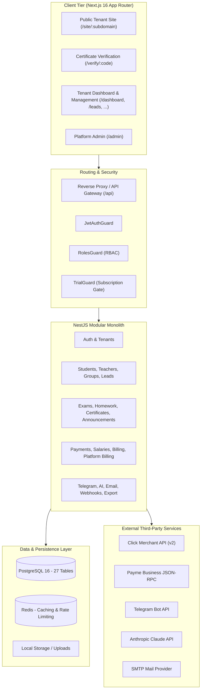

# CRMAPP — REPOSITORY-WIDE TECHNICAL AUDIT REPORT
**Date:** September 2026  
**Architecture Baseline:** [CRMAPP_MASTER_SPEC_V2.md](../CRMAPP_MASTER_SPEC_V2.md)  
**Status:** Architecture Audit & Quality Gate Verification  

---

## A. Executive Summary

A comprehensive repository-wide technical audit of **CRMAPP** was conducted in accordance with **Directive #75** of the Master Specification.

### Current System Health Matrix
| Component | Metric / Command | Status | Notes |
|---|---|---|---|
| **Backend Build** | `nest build` | ✅ **PASS** | Compiles cleanly without TypeScript errors |
| **Backend Lint** | `oxlint src/ test/` | ✅ **PASS** | 0 errors, 0 warnings across 117 files |
| **Backend Unit Tests** | `vitest run` | ✅ **PASS** | 21/21 tests passed across 4 suites |
| **Backend E2E Tests** | `vitest run --config vitest.config.e2e.ts` | ✅ **PASS** | Multi-tenant isolation verified |
| **Frontend Build** | `next build` | ✅ **PASS** | 31/31 routes compiled & statically/dynamically optimized |
| **Frontend Lint** | `eslint` | ✅ **PASS** | 0 errors, 61 warnings (ESLint config aligned for React 19 / Next.js 16) |

### Key Strengths
1. **Multi-Tenant Isolation:** Tenant scoping (`tenantId`) is systematically applied across database queries in services, preventing cross-tenant data leakage.
2. **Payment Domain Separation:** Clear architectural division between **Tenant Billing** (centers receiving fees from students via Click/Payme) and **Platform Billing** (centers subscribing to CRMApp SaaS).
3. **Secure Telegram Linking:** Implements single-use, 15-minute TTL cryptographically generated tokens (`telegram_link_tokens`) rather than insecure raw IDs.
4. **Audit Trail & Soft Deletion:** Comprehensive audit logging (`audit_logs`) and soft deletion (`deletedAt` with trash bin and restore) for students, teachers, and groups.

### Priority Blockers & Gaps Identified
- **P1 (Schema Migrations):** The database schema has rapidly expanded to 27 tables, while `backend/drizzle` contains only the initial migration `0000_blue_sersi.sql`. CI currently uses `drizzle-kit push --force`. A clean baseline migration is needed for production safety.
- **P1 (Scheduling Engine):** Timetables are currently stored as flat strings on `groups` (`schedule`, `scheduleDays`, `startTime`). A dedicated room/timetable conflict engine (Spec Section 17) is needed.
- **P2 (Frontend Role Navigation):** The sidebar displays all navigation links regardless of role (`TEACHER`, `ACCOUNTANT`), causing potential 403 Forbidden errors when non-admins click settings or pricing.
- **P2 (Background Worker Queues):** Telegram notifications and Webhooks fire in-process rather than through BullMQ/Redis worker queues.

---

## B. Architecture Map

---

## C. Module Audit Table

| Module | Status | Current Code | Gaps | Security Risk | Dependencies | Priority |
|---|---|---|---|---|---|---|
| **Auth** | ✅ READY | JWT + Refresh + 2FA + Password Reset | None | Low | `users`, `sessions` | P0 |
| **Tenants** | ✅ READY | Subdomain lookup, trial lifecycle, branding | Custom domain DNS automation pending | Low | `tenants` | P0 |
| **Students** | ✅ READY | CRUD, enrollments, soft delete, search | Bulk import UI | Low | `students`, `enrollments` | P1 |
| **Teachers** | ✅ READY | CRUD, salary config, soft delete | Public teacher profile CMS preview | Low | `teachers` | P1 |
| **Groups** | ⚠️ IMPROVE | CRUD, students link, schedule string | Dedicated slot/calendar engine | Low | `groups`, `teachers` | P1 |
| **Scheduling** | ❌ MISSING | Text fields on `groups` | Room allocation, conflict matrix, calendar grid | Low | `groups`, `branches` | P1 |
| **Attendance** | ✅ READY | Daily group attendance grid, statuses | Biometric/RFID integration | Low | `attendance`, `enrollments` | P1 |
| **Payments** | ✅ READY | Cash/Click/Payme/Bank, receipt tracking | Invoice PDF download | Low | `payments`, `students` | P1 |
| **Salary** | ✅ READY | Percentage, per-student, per-lesson, fixed | Automatic monthly calculation preview | Low | `salary_payments`, `teachers` | P2 |
| **Billing (Center)** | ✅ READY | Click & Payme merchant links for student fees | Webhook test sandbox mode | Medium (Webhook signature validation required) | `billing_transactions` | P0 |
| **Platform Billing** | ✅ READY | Subscription plans, Click & Payme SaaS billing | Auto-recurring card tokenization | Medium | `platform_subscriptions`, `plans` | P0 |
| **Leads** | ✅ READY | Kanban stages, lead source, convert to student | Automated lead ingestion API/webhooks | Low | `leads` | P1 |
| **Exams** | ✅ READY | Questions, attempts, auto-grading, results | Time-limited student test runner UI | Low | `exams`, `exam_questions` | P1 |
| **Certificates** | ✅ READY | Template generation, QR code, public verification | Custom background PDF upload | Low | `certificates` | P1 |
| **Announcements** | ✅ READY | Target audience (ALL, TEACHERS, STUDENTS), pinned | Push notification trigger | Low | `announcements` | P2 |
| **Telegram** | ✅ READY | Secure token linking, menu commands, schedules | Interactive quiz taker bot | Low | `telegram_link_tokens` | P1 |
| **AI** | ✅ READY | Claude SDK, lesson plans, quiz & homework prompt | Provider fallback (OpenAI/Ollama) | Low | Anthropic API | P2 |
| **Audit Logs** | ✅ READY | Entity mutation recording with metadata | Log export & filter by IP/user agent | Low | `audit_logs` | P1 |
| **Branches** | ✅ READY | Multi-branch support per tenant | Branch-level financial separation | Low | `branches` | P2 |
| **Export** | ✅ READY | Excel/CSV export for students, payments, attendance | Scheduled automatic backup export | Low | `exceljs` | P2 |
| **Webhooks** | ⚠️ IMPROVE | Tenant-configured webhook dispatch | Exponential retry queue with BullMQ | Low | `webhooks` | P2 |
| **Parent Portal** | ⚠️ IMPROVE | Handled via Telegram bot menu | Dedicated web portal login for parents | Low | `students` | P2 |

---

## D. Database Audit

### Schema Overview (27 Tables)
1. **Multi-Tenancy Root:** `tenants` (indexed by `subdomain`).
2. **Users & Auth:** `users`, `sessions`.
3. **Core Entities:** `branches`, `teachers`, `groups`, `students`, `enrollments`.
4. **Operations:** `attendance`, `homework`, `homework_completions`, `exams`, `exam_questions`, `exam_results`, `exam_attempts`.
5. **Admissions & Comms:** `leads`, `certificates`, `announcements`, `telegram_link_tokens`.
6. **Financial:** `payments`, `salary_payments`, `billing_transactions`, `plans`, `platform_subscriptions`.
7. **System:** `audit_logs`, `webhooks`, `feature_flags`.

### Findings & Recommendations
1. **Migration State:** Production readiness requires generating formal Drizzle migrations (`drizzle-kit generate`) matching the current 27 tables to eliminate dependency on `push --force`.
2. **Composite Indexes:** Recommend adding composite index `(tenant_id, created_at)` on `attendance`, `payments`, and `audit_logs` for high-throughput query performance.
3. **Foreign Keys & Cascades:** All entity foreign keys are defined with appropriate cascade/set null rules.

---

## E. Security Audit

1. **Tenant Isolation:**
   - Evaluated across services. Every mutating query enforces `eq(table.tenantId, tenantId)`.
   - Direct entity lookups (e.g. `findOne`) verify tenant ownership prior to update or soft delete.
2. **RBAC & Authorization:**
   - NestJS `RolesGuard` verifies JWT payload against `@Roles(...)` metadata.
   - Platform superadmin routes (`/admin`, `/tenants`) are locked to `role === 'SUPERADMIN'`.
3. **Subscription & Trial Gating:**
   - `TrialGuard` blocks non-GET requests when a tenant's trial has expired or status is `SUSPENDED`.
4. **Secret Management:**
   - Sensitive environment variables (`JWT_SECRET`, merchant secret keys, bot tokens) are managed via `ConfigService` and excluded from git.
5. **Telegram Account Linking:**
   - Complies with Master Spec Section 32: Raw IDs cannot be linked; 15-minute crypto tokens (`randomBytes(16)`) are used and invalidated immediately upon use.

---

## F. Frontend Audit

1. **Routes:** 31 total routes (Public landing, Auth, Dashboard, Core CRM, Leads, Exams, Homework, Certificates, Settings, Admin, Public Site).
2. **Role-Based UI Filtering:**
   - Current state: All navigation options are visible in [Sidebar.tsx](../frontend/components/Sidebar.tsx).
   - Action item: Filter navigation items based on `user.role` (e.g., hide Settings, Platform Admin, and SaaS Pricing for `TEACHER`).
3. **Build & Optimizations:**
   - Next.js 16 with Turbopack builds all pages with 0 errors.
   - ESLint warnings tuned for React 19 experimental compiler rules and Uzbek text orthography.

---

## G. Infrastructure Audit

1. **Docker:** `docker-compose.yml` configures PostgreSQL 16, backend, and frontend with appropriate health checks and volume persistence.
2. **CI/CD:** `.github/workflows/ci.yml` runs full backend test suite, lint, typecheck, drizzle schema push, and frontend build.
3. **Observability:** Pino structured logger and Sentry integration hooks configured.

---

## H. Next Recommended Implementation Tasks

Following the Master Spec roadmap, the recommended sequence of work is:

1. **Task 1 (Quick Win): Role-based Frontend Navigation Filter** — Restrict sidebar navigation items so Teachers and Accountants only see their authorized modules.
2. **Task 2: Scheduling & Calendar Engine (Spec Section 17)** — Build the visual timetable/calendar module with conflict detection for rooms and teachers.
3. **Task 3: Production Drizzle Migration Baseline** — Generate formal SQL migration files for the new tables (leads, certificates, announcements, exams).
4. **Task 4: Additional Automated Unit Tests** — Expand Vitest coverage to `students.service`, `payments.service`, and `leads.service`.
